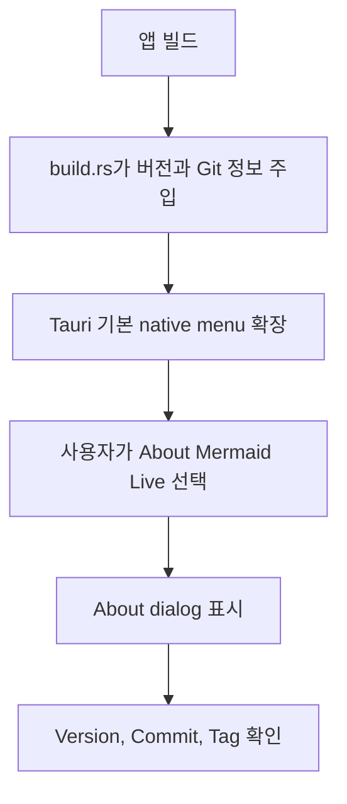

# Native About 메뉴 검증 절차

## 표시 정보

- Version은 `apps/desktop/package.json`의 버전을 빌드 시점에 주입한다.
- Commit은 `GITHUB_SHA`, `COMMIT_SHA`, 또는 `git rev-parse HEAD` 결과를 사용한다.
- Tag는 GitHub Actions의 tag ref 또는 `git tag --points-at HEAD` 결과를 사용한다.
- Commit이나 Tag를 확인할 수 없으면 `unknown`을 표시한다.

## 동작 흐름

## 수동 검증

1. 저장소 루트에서 `pnpm tauri dev`로 앱을 실행한다.
2. macOS에서는 앱 메뉴의 `About Mermaid Live`를 선택한다.
3. Windows/Linux에서는 `Help > About Mermaid Live`를 선택한다.
4. dialog에 앱 이름과 `Version`, `Commit`, `Tag`가 순서대로 표시되는지 확인한다.
5. Version이 `apps/desktop/package.json`과 일치하는지 확인한다.
6. Git 정보를 사용할 수 없는 빌드에서는 `unknown`이 표시되는지 확인한다.

## 자동 검증

- Rust 포맷 검사: `cargo fmt --manifest-path apps/desktop/src-tauri/Cargo.toml -- --check`
- Rust 테스트: `cargo test --locked --manifest-path apps/desktop/src-tauri/Cargo.toml`
- 프론트엔드 타입 검사: `pnpm typecheck`
- 프로덕션 번들: `pnpm tauri build`
