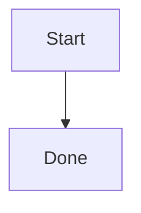
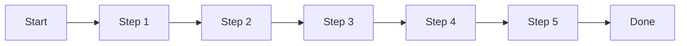
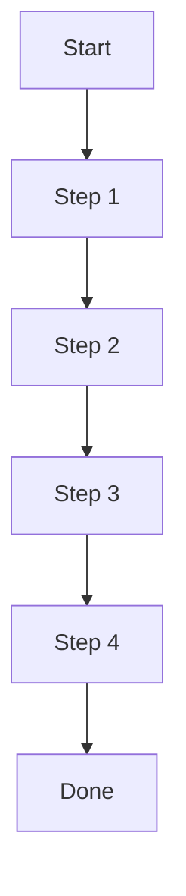

# Quickstart: Mermaid Zoom Fit

## Prerequisites

- Install dependencies from the repository root:

```bash
pnpm install
```

## Run Locally

Start the frontend development server:

```bash
pnpm dev
```

Or start the Tauri app:

```bash
pnpm tauri dev
```

## Manual Verification

1. Open the Mermaid preview with a small diagram:



Expected: the diagram is centered and readable without being unnecessarily reduced.

2. Replace the source with a wide diagram:



Expected: the full diagram fits inside the preview area on initial render.

3. Replace the source with a tall diagram:



Expected: the full diagram fits inside the preview area on initial render.

4. Resize the app window or source/preview split.

Expected: the diagram refits to the new preview area within 1 second and remains centered.

5. Use zoom in, zoom out, pan, and fit controls.

Expected: manual controls still work, and fit recenters the diagram with the best current zoom.

6. Enter invalid Mermaid syntax.

Expected: the existing render error state appears and is not replaced by fit behavior.

## Validation Commands

```bash
pnpm typecheck
pnpm build
```
