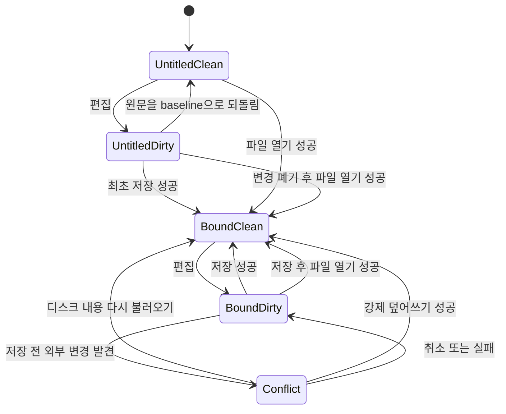

# 데이터 모델: Mermaid 차트 파일 열기 및 저장

## ChartDocument

한 webview에서 편집 중인 하나의 Mermaid 차트 문서를 나타낸다.

### 필드

- `source`: 현재 편집기에 표시되는 UTF-8 Mermaid 원문
- `baselineSource`: 마지막 성공한 열기, 저장, 다시 불러오기 시점의 원문
- `binding`: 선택적 `DocumentFileBinding`; 없으면 제목 없는 새 문서
- `operation`: `idle | opening | saving | closing` 상태

### 파생 값

- `isDirty`: `source !== baselineSource`
- `displayName`: binding이 있으면 `fileName`, 없으면 `제목 없음`
- `windowTitle`: `${dirty 표시}${displayName} — Mermaid Live`

### 검증 규칙

- source와 baselineSource는 임의의 UTF-8 문자열이며 빈 문자열도 허용한다.
- Mermaid 문법 유효성은 파일 열기 조건이 아니다.
- binding은 open/save 성공 결과로만 설정하거나 변경한다.
- 취소, conflict 미해결, 읽기/쓰기 실패에서는 source, baselineSource, binding을 유지한다.

## DocumentFileBinding

현재 문서와 사용자 로컬 파일의 연결을 나타낸다.

### 필드

- `path`: native 계층에서 반환한 절대 경로 문자열
- `fileName`: 창 제목에 표시할 기본 파일명
- `extension`: `mmd | mermaid`
- `revision`: 마지막 성공한 open/save/reload의 `FileRevision`

### 검증 규칙

- extension 비교는 대소문자를 구분하지 않고 정규화한다.
- 확장자가 없는 신규 경로에는 `.mmd`를 붙인다.
- 다른 확장자는 binding으로 만들 수 없다.
- 클립보드 bootstrap 임시 경로는 binding으로 만들지 않는다.

## FileRevision

외부 변경 여부를 비교하는 파일 내용 revision이다.

### 필드

- `contentHash`: 파일 원본 바이트의 SHA-256
- `byteLength`: 원본 바이트 길이
- `modifiedAt`: 선택적 파일 수정 시각; 진단과 최적화 힌트이며 충돌 판정의 권위 값이 아님

### 동일성 규칙

- contentHash와 byteLength가 같으면 같은 내용으로 본다.
- modifiedAt만 달라지고 내용 지문이 같으면 conflict가 아니다.
- 파일 없음, 읽기 불가, UTF-8 decode 실패는 같은 revision으로 간주하지 않는다.

## DiagramFileSnapshot

한 시점의 디스크 파일을 안전하게 문서 모델에 적용하기 위한 값이다.

### 필드

- `source`: 읽은 UTF-8 원문
- `binding`: path, fileName, extension, revision

### 생성 시점

- 지원 파일 open 성공
- 외부 conflict 탐지
- disk 내용 다시 불러오기 성공
- save 또는 force save 성공

## SaveRequest

문서 원문을 파일에 저장하려는 조건부 요청이다.

### 필드

- `source`: 저장할 현재 Mermaid 원문
- `targetPath`: 일반 저장은 현재 path, 최초 저장/다른 이름으로 저장은 선택 전 비어 있을 수 있음
- `expectedRevision`: 연결 파일 일반 저장에는 필수, 신규 경로에는 없음
- `force`: 사용자가 conflict에서 덮어쓰기를 명시한 경우에만 true

### 검증 규칙

- 연결 파일의 일반 저장은 expectedRevision 없이 실행할 수 없다.
- force는 conflict dialog의 명시적 덮어쓰기 선택 이후에만 허용한다.
- target 확장자는 정규화 후 `.mmd` 또는 `.mermaid`여야 한다.

## SaveOutcome

### 변형

- `saved(snapshot)`: 안전한 교체와 revision 계산이 완료됨
- `conflict(diskSnapshot)`: 예상 revision과 현재 disk revision이 다름; 쓰기 없음
- `cancelled`: 경로 선택 또는 사용자 결정이 취소됨; 상태 변화 없음
- `failed(error)`: 읽기, 검증, 권한, 쓰기, 교체 오류; 상태 변화 없음

## PendingDocumentIntent

dirty 보호 결정 뒤 이어서 실행할 작업이다.

### 변형

- `open`: 파일 선택과 현재 문서 교체
- `close`: 현재 window 닫기 승인

### 규칙

- clean 문서는 intent를 즉시 진행한다.
- dirty 문서는 `save | discard | cancel` 결정을 받은 뒤 진행한다.
- save가 취소되거나 실패하면 pending intent도 취소한다.

## 상태 전이

## 관계

- ChartDocument는 0개 또는 1개의 DocumentFileBinding을 가진다.
- DocumentFileBinding은 정확히 1개의 최신 FileRevision을 가진다.
- DiagramFileSnapshot은 ChartDocument의 source, baselineSource, binding을 한 번에 갱신한다.
- PendingDocumentIntent는 ChartDocument의 dirty 상태와 SaveOutcome에 따라 계속되거나 취소된다.
