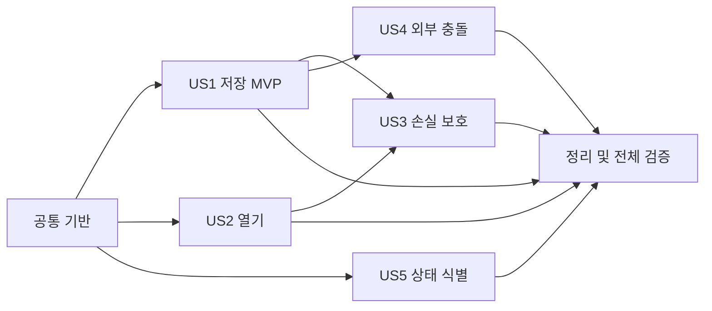

# 작업 목록: Mermaid 차트 파일 열기 및 저장

**입력**: `/specs/002-chart-file-io/`의 설계 문서  
**선행 문서**: `plan.md`, `spec.md`, `research.md`, `data-model.md`, `contracts/`, `quickstart.md`

**테스트**: 문서 상태 전이와 파일 보존이 데이터 안전성의 핵심이므로 프론트엔드 순수 모델 테스트와 Rust 단위·통합 테스트를 각 사용자 스토리의 구현보다 먼저 작성한다.

**구성**: 각 사용자 스토리를 독립적으로 구현하고 검증할 수 있도록 작업을 스토리별 단계로 묶는다.

## 형식: `[ID] [P?] [Story] 설명과 파일 경로`

- **[P]**: 미완료 작업과 의존하지 않고 다른 파일에서 병렬 진행 가능
- **[Story]**: 명세의 사용자 스토리(`US1`~`US5`)와 대응
- 모든 작업 설명에 실제 파일 경로를 포함

## Phase 1: 설정

**목적**: 문서 상태와 native 파일 안전성 테스트를 실행할 도구 및 모듈 경계를 준비한다.

- [X] T001 프론트엔드 테스트용 Vitest 4 의존성과 `test` 스크립트를 `apps/desktop/package.json`에 추가하고 workspace 잠금 정보를 `pnpm-lock.yaml`에 반영한다.
- [X] T002 [P] 내용 지문과 임시 sibling 파일 생성을 위한 `sha2` 0.10 및 `tempfile` 3 의존성을 `apps/desktop/src-tauri/Cargo.toml`과 `apps/desktop/src-tauri/Cargo.lock`에 추가한다.
- [X] T003 [P] `apps/desktop/vite.config.ts`에 jsdom을 사용하지 않는 순수 모델 Vitest 설정과 테스트 파일 포함 규칙을 추가한다.
- [X] T004 [P] `apps/desktop/src/entities/chart-document/index.ts`와 `apps/desktop/src/features/manage-chart-document/index.ts`에 새 FSD public API 진입점을 만든다.
- [X] T005 [P] `apps/desktop/src-tauri/src/domain/mod.rs`, `apps/desktop/src-tauri/src/adapters/outbound/mod.rs`, `apps/desktop/src-tauri/src/infrastructure/mod.rs`에 새 chart document 모듈 선언을 준비한다.

---

## Phase 2: 공통 기반

**목적**: 모든 사용자 스토리가 공유하는 문서 상태, native 도메인 계약, 파일 port와 command DTO를 구현한다.

**중요**: 이 단계가 끝나기 전에는 사용자 스토리 구현을 시작하지 않는다.

- [X] T006 프론트엔드 `ChartDocument`, `DocumentFileBinding`, `FileRevision`, `DiagramFileSnapshot`, dirty/title 파생 규칙과 순수 상태 전이를 `apps/desktop/src/entities/chart-document/model/chart-document.ts`에 구현한다.
- [X] T007 [P] 제목 없음·binding·dirty·snapshot 적용·취소 시 상태 불변의 순수 모델 테스트를 `apps/desktop/src/entities/chart-document/model/chart-document.test.ts`에 작성하고 구현 전 실패를 확인한다.
- [X] T008 `.mmd`/`.mermaid` 정규화, 기본 `.mmd` 적용, `FileRevision`, snapshot, save outcome 및 typed error를 `apps/desktop/src-tauri/src/domain/chart_document.rs`에 정의한다.
- [X] T009 [P] 지원 확장자 대소문자 처리, 확장자 없음 기본값, 지원하지 않는 확장자 거부 테스트를 `apps/desktop/src-tauri/src/domain/chart_document.rs`의 test module에 먼저 작성한다.
- [X] T010 `ChartFileRepository`와 조건부 read/write 입력·결과 port를 `apps/desktop/src-tauri/src/application/ports.rs`에 추가한다.
- [X] T011 [P] 문서 파일 command의 camelCase DTO, tagged outcome과 typed error 직렬화 타입을 `apps/desktop/src-tauri/src/adapters/inbound/tauri_commands.rs`에 정의한다.
- [X] T012 [P] 프론트엔드 command DTO와 `invoke` wrapper를 `apps/desktop/src/features/manage-chart-document/api/chart-file.ts`에 구현한다.
- [X] T013 문서 controller의 공통 event subscription, pending operation 직렬화, entity 상태 노출 골격을 `apps/desktop/src/features/manage-chart-document/model/use-chart-document.ts`에 구현한다.
- [X] T014 native file repository와 application use case를 주입할 상태 구조를 `apps/desktop/src-tauri/src/infrastructure/app_state.rs`에 확장한다.

**체크포인트**: 순수 문서 모델과 native 파일 계약이 컴파일되고 사용자 스토리별 동작을 추가할 수 있다.

---

## Phase 3: 사용자 스토리 1 - 차트 문서를 파일로 저장 (우선순위: P1) MVP

**목표**: 새 문서를 `.mmd`/`.mermaid`로 처음 저장하고, 연결 파일에 일반 저장하며, 다른 이름으로 저장할 수 있다.

**독립 테스트**: 제목 없는 문서를 저장한 뒤 수정·재저장하고, 다른 이름으로 저장하여 binding과 baseline이 성공 후에만 바뀌는지 확인한다.

### 테스트

- [X] T015 [P] [US1] 신규 저장·일반 저장·다른 이름 저장·지원하지 않는 확장자·취소·쓰기 실패에 대한 fake repository use case 테스트를 `apps/desktop/src-tauri/src/application/use_cases.rs`에 먼저 작성한다.
- [X] T016 [P] [US1] UTF-8/줄바꿈 exact round trip, 안전 저장 성공, 임시 파일 쓰기 실패 시 기존 파일 보존 통합 테스트를 `apps/desktop/src-tauri/src/adapters/outbound/local_chart_file_repository.rs`에 먼저 작성한다.
- [X] T017 [P] [US1] 최초 저장과 다른 이름 저장 성공에서만 baseline/binding이 바뀌고 취소·실패에서는 dirty 상태가 유지되는 테스트를 `apps/desktop/src/entities/chart-document/model/chart-document.test.ts`에 먼저 추가한다.

### 구현

- [X] T018 [US1] 신규 저장·연결 파일 저장·다른 이름 저장 application use case와 성공 후 revision 계산을 `apps/desktop/src-tauri/src/application/use_cases.rs`에 구현한다.
- [X] T019 [US1] SHA-256 revision 계산과 같은 디렉터리 임시 파일 작성·flush·sync·교체·실패 정리를 `apps/desktop/src-tauri/src/adapters/outbound/local_chart_file_repository.rs`에 구현한다.
- [X] T020 [P] [US1] `.mmd`/`.mermaid` 필터, 확장자 없음 `.mmd` 적용, 취소 결과를 제공하는 Save As dialog adapter를 `apps/desktop/src-tauri/src/adapters/outbound/chart_file_dialog.rs`에 구현한다.
- [X] T021 [US1] `save_diagram_file` command를 새 save contract와 application state에 연결하고 기존 direct filesystem save 경로를 `apps/desktop/src-tauri/src/adapters/inbound/tauri_commands.rs`에서 제거한다.
- [X] T022 [US1] 저장과 다른 이름으로 저장 메뉴 항목, `CmdOrCtrl+S`/`CmdOrCtrl+Shift+S` accelerator 및 활성 webview event 전달을 `apps/desktop/src-tauri/src/adapters/inbound/window_menu.rs`에 구현한다.
- [X] T023 [US1] 저장 menu event, Save As, 성공·취소·실패 후 문서 상태 전이를 `apps/desktop/src/features/manage-chart-document/model/use-chart-document.ts`에 구현한다.
- [X] T024 [US1] 문서 controller의 source와 edit action을 `apps/desktop/src/pages/editor/ui/editor-page.tsx`에 연결하고 기존 `apps/desktop/src/features/save-diagram/model/use-save-diagram-request.ts` 사용을 제거한다.
- [X] T025 [US1] 새 command를 등록하고 기존 saver module을 대체하도록 `apps/desktop/src-tauri/src/lib.rs`와 `apps/desktop/src-tauri/src/adapters/outbound/mod.rs`의 wiring을 갱신한다.

**체크포인트**: 파일을 열지 않아도 새 문서의 최초 저장·재저장·다른 이름 저장을 독립적으로 검증할 수 있다.

---

## Phase 4: 사용자 스토리 2 - 기존 차트 파일 열기 (우선순위: P1)

**목표**: `.mmd` 또는 `.mermaid` 파일을 선택해 현재 활성 편집기에서 열고 같은 파일에 저장할 수 있다.

**독립 테스트**: 유효·문법 오류·빈 지원 파일을 각각 열어 원문과 binding이 적용되고 이후 저장이 원본 파일을 갱신하는지 확인한다.

### 테스트

- [X] T026 [P] [US2] 지원 파일 open, 빈 원문, 문법 오류 원문, 비 UTF-8, missing, permission failure의 application/repository 테스트를 `apps/desktop/src-tauri/src/application/use_cases.rs`와 `apps/desktop/src-tauri/src/adapters/outbound/local_chart_file_repository.rs`에 먼저 작성한다.
- [X] T027 [P] [US2] opened snapshot 적용, open 취소·실패 시 기존 문서 불변, 클립보드 bootstrap의 untitled 유지 테스트를 `apps/desktop/src/entities/chart-document/model/chart-document.test.ts`에 먼저 추가한다.

### 구현

- [X] T028 [US2] 지원 확장자 검증·UTF-8 읽기·revision 계산을 수행하는 open use case를 `apps/desktop/src-tauri/src/application/use_cases.rs`에 구현한다.
- [X] T029 [P] [US2] `.mmd`/`.mermaid`만 표시하고 취소를 정상 outcome으로 반환하는 Open dialog adapter를 `apps/desktop/src-tauri/src/adapters/outbound/chart_file_dialog.rs`에 구현한다.
- [X] T030 [US2] `open_diagram_file` command를 `apps/desktop/src-tauri/src/adapters/inbound/tauri_commands.rs`에 구현하고 `apps/desktop/src-tauri/src/lib.rs`에 등록한다.
- [X] T031 [US2] 열기 메뉴와 `CmdOrCtrl+O` accelerator를 추가하고 활성 webview에 open intent를 전달하도록 `apps/desktop/src-tauri/src/adapters/inbound/window_menu.rs`를 갱신한다.
- [X] T032 [US2] open event에서 snapshot을 현재 문서에 적용하고 취소·오류 시 상태를 유지하도록 `apps/desktop/src/features/manage-chart-document/model/use-chart-document.ts`와 `apps/desktop/src/features/manage-chart-document/api/chart-file.ts`를 연결한다.
- [X] T033 [US2] 기존 query-string `sourceFile` bootstrap을 untitled baseline으로 적용하고 temp 경로를 binding으로 만들지 않도록 `apps/desktop/src/pages/editor/ui/editor-page.tsx`를 갱신한다.

**체크포인트**: 열기 기능만으로 지원 파일을 현재 편집기에서 확인·수정할 수 있고 US1 저장 흐름과 결합해 원본에 저장할 수 있다.

---

## Phase 5: 사용자 스토리 3 - 저장하지 않은 변경 보호 (우선순위: P2)

**목표**: dirty 문서에서 파일 열기 또는 window 닫기 시 저장·저장 안 함·취소 선택으로 데이터 손실을 방지한다.

**독립 테스트**: dirty 문서에서 open/close를 요청하고 세 선택 및 저장 취소·실패 경로가 pending intent를 올바르게 계속하거나 중단하는지 확인한다.

### 테스트

- [X] T034 [P] [US3] open/close pending intent의 save·discard·cancel 및 저장 실패·취소 상태 전이 테스트를 `apps/desktop/src/entities/chart-document/model/chart-document.test.ts`에 먼저 작성한다.
- [X] T035 [P] [US3] window별 one-shot close authorization의 등록·단일 소비·다른 window 격리 테스트를 `apps/desktop/src-tauri/src/infrastructure/document_window_lifecycle.rs`에 먼저 작성한다.
- [X] T036 [P] [US3] custom Yes/No/Cancel 결과를 save/discard/cancel로 매핑하는 adapter 테스트를 `apps/desktop/src-tauri/src/adapters/outbound/chart_file_dialog.rs`에 먼저 작성한다.

### 구현

- [X] T037 [US3] dirty open/close에 사용할 손실 방지 native dialog와 typed 결정을 `apps/desktop/src-tauri/src/adapters/outbound/chart_file_dialog.rs`에 구현한다.
- [X] T038 [US3] `prompt_unsaved_changes` 및 `authorize_window_close` command를 `apps/desktop/src-tauri/src/adapters/inbound/tauri_commands.rs`에 구현하고 `apps/desktop/src-tauri/src/lib.rs`에 등록한다.
- [X] T039 [US3] close 요청 보류·webview event·one-shot 승인 소비를 `apps/desktop/src-tauri/src/infrastructure/document_window_lifecycle.rs`에 구현한다.
- [X] T040 [US3] 기존 clipboard focus 처리와 close 보호가 함께 동작하도록 `apps/desktop/src-tauri/src/infrastructure/window_lifecycle.rs`와 `apps/desktop/src-tauri/src/lib.rs`의 window event wiring을 조정한다.
- [X] T041 [US3] dirty 상태에서 open/close intent를 직렬화하고 dialog 결정 및 저장 결과에 따라 후속 작업을 수행하도록 `apps/desktop/src/features/manage-chart-document/model/use-chart-document.ts`를 구현한다.

**체크포인트**: 미저장 변경은 사용자 결정 없이 닫기나 open으로 사라지지 않으며 저장 실패 시 현재 문서가 유지된다.

---

## Phase 6: 사용자 스토리 4 - 외부 파일 변경 충돌 보호 (우선순위: P2)

**목표**: 연결 파일이 외부에서 변경된 경우 다시 불러오기·덮어쓰기·취소를 선택하기 전에는 어느 내용도 잃지 않는다.

**독립 테스트**: open 후 disk 내용을 바꾸고 저장하여 conflict를 만든 뒤 세 결정을 각각 검증한다.

### 테스트

- [X] T042 [P] [US4] 동일 revision 저장, 내용 변경 conflict, metadata-only 변경 비충돌, missing/unreadable, force overwrite를 fake repository로 검증하는 테스트를 `apps/desktop/src-tauri/src/application/use_cases.rs`에 먼저 작성한다.
- [X] T043 [P] [US4] 실제 외부 수정 후 conflict에서 원본 쓰기 없음과 force 저장 후 revision 갱신을 검증하는 tempdir 테스트를 `apps/desktop/src-tauri/src/adapters/outbound/local_chart_file_repository.rs`에 먼저 작성한다.
- [X] T044 [P] [US4] reload·overwrite·cancel 및 재검증 실패 시 source/baseline/binding 전이 테스트를 `apps/desktop/src/entities/chart-document/model/chart-document.test.ts`에 먼저 작성한다.

### 구현

- [X] T045 [US4] expected revision 비교, `conflict(diskSnapshot)`, missing/unreadable 결과와 명시적 force save를 `apps/desktop/src-tauri/src/application/use_cases.rs`에 구현한다.
- [X] T046 [P] [US4] reload/overwrite/cancel custom native dialog와 결과 매핑을 `apps/desktop/src-tauri/src/adapters/outbound/chart_file_dialog.rs`에 구현한다.
- [X] T047 [US4] `prompt_external_conflict` command와 conflict DTO 매핑을 `apps/desktop/src-tauri/src/adapters/inbound/tauri_commands.rs`에 구현한다.
- [X] T048 [US4] save conflict 결과에서 reload snapshot 적용, force overwrite 재요청, cancel 상태 유지를 조정하도록 `apps/desktop/src/features/manage-chart-document/model/use-chart-document.ts`를 구현한다.

**체크포인트**: 외부 변경 시 silent overwrite가 없고 사용자의 세 가지 결정이 계약대로 동작한다.

---

## Phase 7: 사용자 스토리 5 - 현재 문서 상태 식별 (우선순위: P3)

**목표**: 창 제목에서 제목 없음 또는 현재 파일명과 dirty 상태를 즉시 확인할 수 있다.

**독립 테스트**: untitled clean, untitled dirty, bound clean, bound dirty, save/open/reload/cancel/failure 상태에서 제목이 실제 문서 상태와 일치하는지 확인한다.

### 테스트

- [X] T049 [P] [US5] 모든 문서 상태의 display name과 window title 파생 값 테스트를 `apps/desktop/src/entities/chart-document/model/chart-document.test.ts`에 먼저 작성한다.
- [X] T050 [P] [US5] title update 호출이 문서 상태 변경 때만 발생하고 취소·실패에서 기존 제목을 유지하는 controller 테스트를 `apps/desktop/src/features/manage-chart-document/model/use-chart-document.test.ts`에 먼저 작성한다.

### 구현

- [X] T051 [US5] 제목 없음·파일명·dirty 표시를 만드는 title 파생 함수를 `apps/desktop/src/entities/chart-document/model/chart-document.ts`에 구현한다.
- [X] T052 [US5] 문서 상태 전이 후 현재 webview 제목을 동기화하도록 `apps/desktop/src/features/manage-chart-document/model/use-chart-document.ts`에 `@tauri-apps/api/window` 연동을 추가한다.

**체크포인트**: 여러 창/탭에서 각 webview의 제목이 자체 문서 파일명과 dirty 상태만 표시한다.

---

## Phase 8: 정리 및 교차 검증

**목적**: 기존 임시 구현을 제거하고 전체 사용자 여정, 아키텍처 경계와 빌드를 검증한다.

- [X] T053 기존 `apps/desktop/src/features/save-diagram/`과 `apps/desktop/src-tauri/src/adapters/outbound/diagram_file_saver.rs`의 잔여 사용을 제거하고 새 public API로 import를 정리한다.
- [X] T054 [P] command·menu event 문자열을 공통 상수로 정리하고 등록 누락 검증 테스트를 `apps/desktop/src-tauri/src/adapters/inbound/window_menu.rs`에 추가한다.
- [X] T055 [P] native domain/application이 Tauri·filesystem 구현에 의존하지 않는지 `apps/desktop/src-tauri/src/domain/`, `apps/desktop/src-tauri/src/application/` 경계를 검토하고 위반을 수정한다.
- [ ] T056 검증 기준인 `specs/002-chart-file-io/quickstart.md`의 자동 명령과 새 문서 저장·열기·손실 보호·외부 충돌·오류 수동 시나리오를 실행하고 결과를 문서에 기록한다.
- [X] T057 `pnpm typecheck`, `pnpm --filter @mermaid-live/desktop test`, `cargo fmt --manifest-path apps/desktop/src-tauri/Cargo.toml -- --check`, `cargo test --locked --manifest-path apps/desktop/src-tauri/Cargo.toml`, `pnpm build`, `pnpm tauri build`를 실행하고 `specs/002-chart-file-io/quickstart.md` 완료 기준을 확인한다.

---

## 의존성 및 실행 순서

### 단계 의존성

- **Phase 1 설정**: 즉시 시작 가능하다.
- **Phase 2 공통 기반**: Phase 1 완료 후 진행하며 모든 사용자 스토리를 차단한다.
- **US1 저장(Phase 3)**: 공통 기반 이후 시작하는 MVP다.
- **US2 열기(Phase 4)**: 공통 기반 이후 open 자체를 구현할 수 있으며 같은 파일 저장 검증은 US1을 사용한다.
- **US3 손실 보호(Phase 5)**: 공통 기반 이후 구현할 수 있으나 `저장 후 계속` 분기의 완전한 통합 검증은 US1과 US2가 필요하다.
- **US4 외부 충돌(Phase 6)**: US1의 연결 파일 저장과 revision 반환에 의존한다.
- **US5 상태 식별(Phase 7)**: 공통 기반 이후 독립 구현 가능하며 전체 전이 검증은 US1~US4 결과를 사용한다.
- **Phase 8 정리**: 목표로 하는 모든 사용자 스토리 완료 후 수행한다.

### 사용자 스토리 의존성 그래프



### 스토리 내부 순서

- 각 스토리의 test task를 먼저 작성하고 실패를 확인한다.
- domain/entity 모델을 use case와 adapter보다 먼저 완성한다.
- application use case를 command와 frontend orchestration보다 먼저 완성한다.
- 성공 결과를 받은 후에만 binding, baseline, revision을 갱신한다.
- story checkpoint를 통과한 뒤 다음 의존 story로 진행한다.

### 병렬 실행 기회

- Phase 1의 T002~T005는 서로 다른 파일을 중심으로 병렬 진행할 수 있다.
- Phase 2의 frontend 모델 테스트, native domain 테스트, DTO/wrapper는 병렬 진행할 수 있다.
- 각 스토리의 `[P]` test task는 구현 전에 병렬 작성할 수 있다.
- 공통 기반 이후 US1, US2의 open-only 부분, US5 모델 부분은 다른 담당자가 병렬 진행할 수 있다.
- native repository 작업과 frontend entity/controller 테스트는 파일 충돌 없이 병렬 진행할 수 있다.

---

## 사용자 스토리별 병렬 예시

### 사용자 스토리 1

```text
Task: "T015 fake repository 저장 use case 테스트"
Task: "T016 안전 저장 tempdir 통합 테스트"
Task: "T017 frontend 저장 상태 전이 테스트"
```

### 사용자 스토리 2

```text
Task: "T026 native open 오류/성공 테스트"
Task: "T027 frontend snapshot 적용 테스트"
```

### 사용자 스토리 3

```text
Task: "T034 pending intent frontend 테스트"
Task: "T035 one-shot close authorization 테스트"
Task: "T036 native dialog 결과 매핑 테스트"
```

### 사용자 스토리 4

```text
Task: "T042 조건부 저장 use case 테스트"
Task: "T043 실제 외부 변경 tempdir 테스트"
Task: "T044 frontend conflict 전이 테스트"
```

### 사용자 스토리 5

```text
Task: "T049 title 파생 값 테스트"
Task: "T050 controller title 동기화 테스트"
```

---

## 구현 전략

### MVP 우선

1. Phase 1 설정 완료
2. Phase 2 공통 기반 완료
3. Phase 3 사용자 스토리 1 완료
4. 새 문서 최초 저장·일반 저장·다른 이름 저장을 독립 검증
5. 데이터 보존 기준을 만족하면 저장 MVP 시연 가능

### 점진적 제공

1. **저장 MVP**: 제목 없는 문서를 파일로 보존하고 다시 저장
2. **열기**: 기존 파일을 현재 편집기에 불러와 저장 workflow 완성
3. **손실 보호**: open/close의 파괴적 전이를 사용자 결정으로 보호
4. **외부 충돌 보호**: 다른 프로그램과 함께 사용할 때 silent overwrite 제거
5. **상태 식별**: 창/탭 제목으로 문서 및 dirty 상태 확인
6. **정리와 전체 검증**: 기존 임시 경로 제거, quickstart와 bundle 검증

### 병렬 팀 전략

1. 팀이 Phase 1과 Phase 2를 함께 완료한다.
2. 이후 native 파일 repository/use case 담당과 frontend entity/controller 담당을 분리한다.
3. US1 저장 계약을 고정한 뒤 US3/US4 담당자가 보호 흐름을 병렬 구현한다.
4. menu/close lifecycle 담당은 event 문자열과 window별 routing을 통합 검증한다.

---

## 참고

- `[P]`는 파일 충돌과 미완료 의존성이 없는 작업에만 표시했다.
- `[US1]`~`[US5]`는 `spec.md`의 사용자 스토리와 직접 대응한다.
- test task는 해당 구현보다 먼저 실행해 실패를 확인한다.
- Tauri/native UI 자동화 대신 순수 상태, adapter mapping, fake repository, tempdir 통합 테스트를 우선한다.
- 각 체크포인트에서 독립 검증이 실패하면 다음 의존 단계로 진행하지 않는다.
