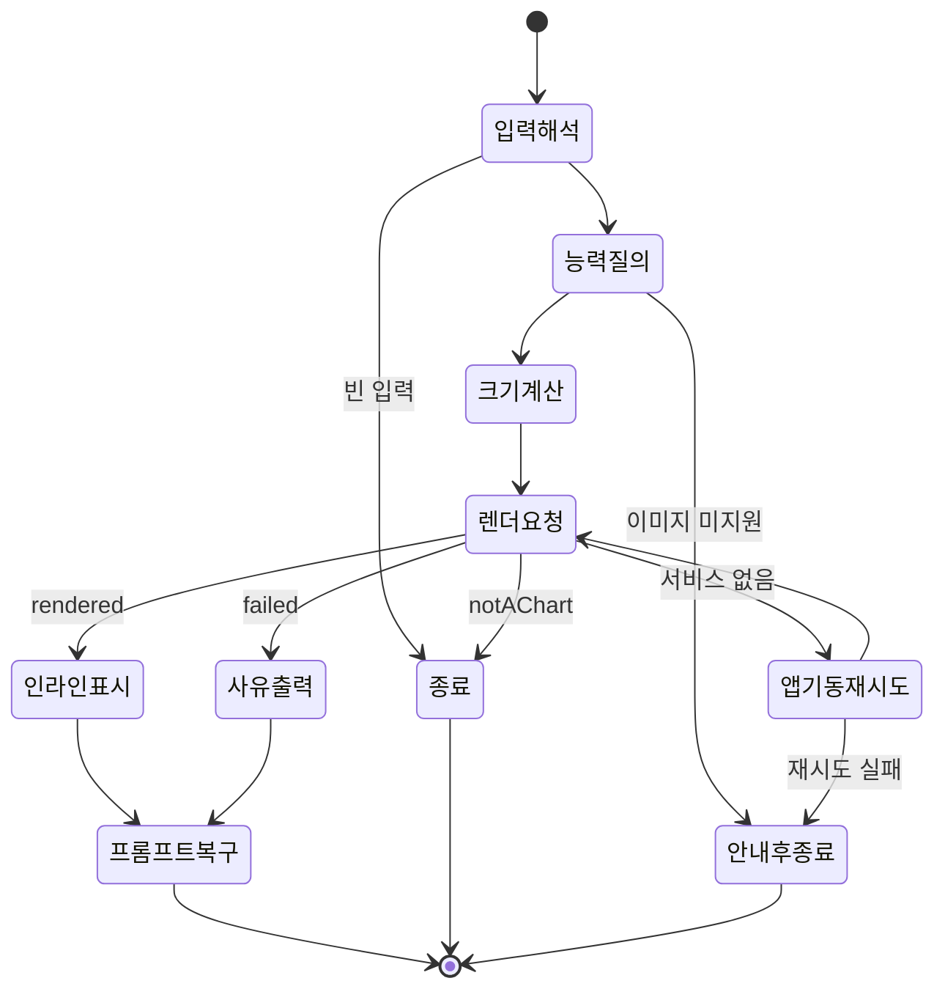

# Data Model: Terminal Inline Render

## Selected Text

사용자가 터미널에서 선택해 클립보드에 담긴 원본 텍스트. 차트일 수도 있고 아닐 수도 있다.

**속성**

- `text`: 원본 문자열. 펜스 코드 블록, frontmatter, directive, 주석을 포함할 수 있다.

**규칙**

- 비어 있거나 공백뿐이면 요청을 만들지 않는다.
- 차트 판별 전에 크기 상한을 적용한다. 기존 클립보드 경로와 동일하게 512KiB를 넘는 입력은 처리하지 않는다.
- 판별과 추출은 CLI가 아니라 네이티브 도메인 함수가 수행한다.

## Terminal Capability

CLI가 실행된 터미널의 표시 능력. 매 실행 시 질의로 확인한다.

**속성**

- `supportsGraphics`: kitty graphics protocol 지원 여부.
- `cellWidthPx`, `cellHeightPx`: 한 칸의 픽셀 크기. 질의 실패 시 미확정 상태를 가진다.
- `columns`, `rows`: 현재 창의 칸 수.

**규칙**

- `supportsGraphics`가 거짓이면 어떤 제어 문자도 출력하지 않고 안내 후 종료한다.
- 셀 크기는 `CSI 16 t`를 먼저 시도하고 `CSI 14 t`를 폴백으로 사용한다.
- 셀 크기가 미확정이면 열 수만 사용하는 폭 기준 표시로 축소한다.

## Display Area

차트가 표시될 사용 가능한 칸 격자 영역.

**속성**

- `availableColumns`: 좌우 여백을 뺀 사용 가능한 열 수.
- `availableRows`: 프롬프트 공간을 남긴 사용 가능한 행 수.

**규칙**

- 프롬프트가 밀려나지 않도록 화면 높이 전체를 사용하지 않는다.
- 창이 매우 좁아도 최소 표시 폭을 보장한다.

## Chart Render Request

CLI가 앱에 보내는 렌더링 요청.

**속성**

- `requestId`: 응답을 요청과 짝짓는 식별자.
- `text`: 선택된 원본 텍스트.
- `widthPx`, `heightPx`: 목표 표시 픽셀 크기.
- `scale`: 고해상도 화면을 위한 배율.

**규칙**

- 목표 픽셀 크기는 `Display Area`와 셀 크기에서 계산한다.
- 하나의 요청은 하나의 응답만 받는다.
- 응답이 정해진 시간 안에 오지 않으면 요청을 포기하고 관련 자원을 정리한다.

## Rendered Chart Image

래스터화 결과.

**속성**

- `pngBytes`: PNG 이미지 데이터.
- `fingerprint`: 차트 원문의 안정적 식별자. 기존 클립보드 경로와 동일한 방식으로 계산한다.

**규칙**

- `fingerprint`와 목표 크기가 같은 요청은 캐시된 결과를 재사용한다.
- 캐시 파일은 기존 임시 디렉터리 규칙 아래에 둔다.
- 원본 비율은 래스터화 시점에 이미 확정되며, 터미널 표시 단계에서 왜곡하지 않는다.

## Render Outcome

요청에 대한 앱의 응답. 세 가지 중 하나다.

- **rendered**: 이미지가 준비되었다. `Rendered Chart Image`를 포함한다.
- **notAChart**: 입력이 Mermaid 차트가 아니다. 사용자에게 아무것도 표시하지 않는다.
- **failed**: 차트로 판별되었으나 렌더링에 실패했다. 한 줄 사유를 포함한다.

## State Transitions

