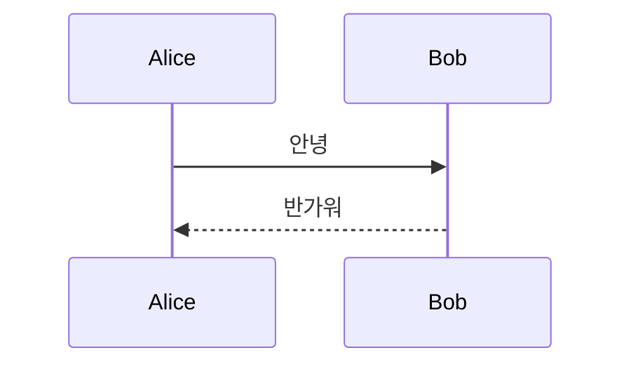

# Quickstart: Terminal Inline Render

## Prerequisites

- macOS, zsh
- 저장소 루트에서 `pnpm install` 완료
- `cargo install --path crates/mmdcat` 으로 CLI 설치(또는 `cd crates && cargo build --release`)
- Rust 툴체인(Tauri 2 빌드 가능)
- kitty graphics protocol을 지원하는 터미널: Ghostty, WezTerm, kitty 중 하나

## Terminal Setup

터미널마다 필요한 설정만 적용한다.

**Ghostty** — `~/.config/ghostty/config`에 다음이 **필수**다.

```
copy-on-select = clipboard
```

기본값 `true`는 문서상 selection clipboard를 우선하며, Ghostty는 macOS에서도 middle-click paste용 selection clipboard를 따로 유지하므로 `pbpaste`가 보지 못한다. 유효값은 `false`, `true`, `clipboard` 셋이며 `ghostty +validate-config`로 확인했다.

클립보드를 건드리지 않으려면 대신 Ghostty의 선택 내보내기를 쓴다.

```
keybind = super+shift+m=write_selection_file:paste,plain
```

**kitty** — `copy_on_select` 기본값이 `no`이므로 `~/.config/kitty/kitty.conf`에 다음이 **필수**다.

```
copy_on_select clipboard
```

선택 사항으로 kitty 고유의 원키 경로를 쓸 수 있다.

```
map cmd+shift+m launch --type=overlay --stdin-source=@selection mmdcat -
```

**WezTerm** — 마우스 선택 시 클립보드 복사가 기본 동작이다. 버전 편차를 대비해 `~/.wezterm.lua`에 다음을 명시한다.

```lua
config.enable_kitty_graphics = true
```

## Shell Setup

`~/.zshrc`에 셸 위젯을 불러오고 단축키를 바인딩한다.

```sh
source /Users/yoophi/project/mermaid-live/crates/mmdcat/shell/mmdcat.zsh
```

기본 바인딩은 `^Xv`다. `^Xm`은 zsh 기본값으로 `_most_recent_file`에 잡혀 있어 피했다. 다른 키를 쓰려면 source 전에 `MMDCAT_KEY`를 설정한다.

## Keep the Renderer Running

렌더링은 실행 중인 앱의 webview 가 담당하므로 앱이 떠 있어야 한다. 앱은 창 없이 메뉴바에만 상주하도록 설정되어 있다.

```bash
pnpm tauri build --bundles app
cp -R apps/desktop/src-tauri/target/release/bundle/macos/*.app /Applications/
pnpm install:agent
```

`install:agent` 는 `~/Library/LaunchAgents` 에 LaunchAgent 를 설치해 로그인 시 자동 실행한다. 해제는 `node scripts/install-launch-agent.mjs --uninstall`.

개발 중에는 `pnpm tauri dev` 로 대신할 수 있다. **구버전 번들이 `/Applications` 에 남아 있으면 `mmdcat` 의 자동 기동이 그것을 띄우고 소켓이 열리지 않으므로, 번들을 갱신하거나 지워야 한다.**

## Run Locally

```bash
# 1) 렌더를 담당하는 데스크톱 앱을 띄운다
pnpm tauri dev

# 2) 다른 터미널 탭에서 준비 상태를 확인한다
mmdcat --probe
```

`--probe`는 터미널 종류, 이미지 표시 지원 여부, 셀 픽셀 크기, **클립보드 내용**, 렌더 소켓 연결 상태를 출력한다. `cargo install` 을 하면 `~/.cargo/bin/mmdcat` 으로 PATH 에 들어간다.

주의: Claude Code나 Codex 같은 전체 화면 TUI 안에서는 zsh 행 편집기가 없어 단축키 위젯이 존재하지 않는다. Ghostty 분할(`Cmd+D`)로 셸 pane을 띄우고, 차트는 TUI pane에서 선택한 뒤 셸 pane에서 단축키를 누른다.

## Manual Verification

### 1. 기본 흐름 (US1)

터미널에 차트를 출력한다.

```bash
cat <<'CHART'
flowchart LR
  A[선택] --> B[단축키]
  B --> C[인라인 표시]
CHART
```

출력된 세 줄을 드래그로 선택하고 `Ctrl+X` → `v`를 누른다.

- 같은 터미널 화면에 차트 이미지가 나타나야 한다.
- 차트 전체가 잘리지 않고 보여야 한다.
- 프롬프트가 정상 상태로 남아 있어야 한다.

### 2. htmlLabels 차이 확인 (최우선 확인 지점)

`flowchart`는 라벨을 `foreignObject`로 그리는 기본값 때문에 래스터화 경로에서 라벨이 사라질 수 있다. 위 1번 차트에서 **노드 안의 한글 라벨이 보이는지 반드시 먼저 확인한다.** 라벨이 비어 보이면 래스터화 경로의 `htmlLabels` 설정이 적용되지 않은 것이다.

### 3. 펜스 코드 블록 (US1)

```bash
cat <<'CHART'
설명 문장입니다.


CHART
```

펜스를 포함해 선택해도 차트 본문만 렌더되어야 한다.

### 4. 차트가 아닌 텍스트 (US2)

```bash
echo "this text mentions graph but is not a diagram"
```

선택하고 `Ctrl+X` → `v`를 누른다. **아무 출력도 없어야 한다.**

### 5. 잘못된 문법 (US2)

```bash
cat <<'CHART'
flowchart LR
  A --> --> B
CHART
```

한 줄 실패 사유가 안내되어야 한다.

### 6. 큰 차트 (Edge Case)

노드가 30개 이상인 차트를 선택해 표시한다. 화면 높이를 넘겨 프롬프트를 밀어내지 않아야 한다.

### 7. 재표시 성능 (SC-002)

1번 차트를 다시 선택해 표시한다. 첫 표시보다 눈에 띄게 빨라야 한다.

### 8. 터미널 교차 검증 (US3)

Ghostty, WezTerm, kitty에서 각각 1번과 4번을 반복해 같은 결과가 나오는지 확인한다.

### 9. 감시 모드 (US4)

```bash
mmdcat --watch
```

실행해 두고 다른 창에서 Mermaid 차트를 복사한다.

- 시작 시 `watching the clipboard` 안내가 나와야 한다. 트레이에서 감시를 껐다면 그 사실을 알리는 문구가 대신 나온다.
- 차트를 복사하면 시각과 라벨 한 줄 뒤에 차트가 나타난다.
- 차트가 아닌 텍스트를 복사하면 아무것도 나타나지 않는다.
- 같은 차트를 다시 복사해도 반복 표시되지 않는다.
- **트레이 알림과 배지가 뜨지 않아야 한다.** 터미널에서 이미 봤기 때문이다.
- 창 크기를 바꾼 뒤 새 차트를 복사하면 새 크기에 맞춰 표시된다.
- `mmdcat --watch --clear` 는 매번 화면을 지우고 최신 차트만 보여 준다.

## Validation Commands

```bash
# 네이티브 단위 테스트
cd apps/desktop/src-tauri && cargo test

# 공유 crate 와 CLI 테스트
cd crates && cargo test

# 타입·린트
pnpm typecheck
```

## Notes

- 인라인 이미지 표시는 실제 tty가 필요하다. 캡처된 출력이나 파이프를 통해서는 확인할 수 없으므로 Manual Verification은 반드시 터미널에서 직접 수행한다.
- 데스크톱 앱이 실행 중이 아니면 CLI가 앱을 기동하고 재시도한다. 이 경우 첫 표시가 수 초 걸릴 수 있다.
